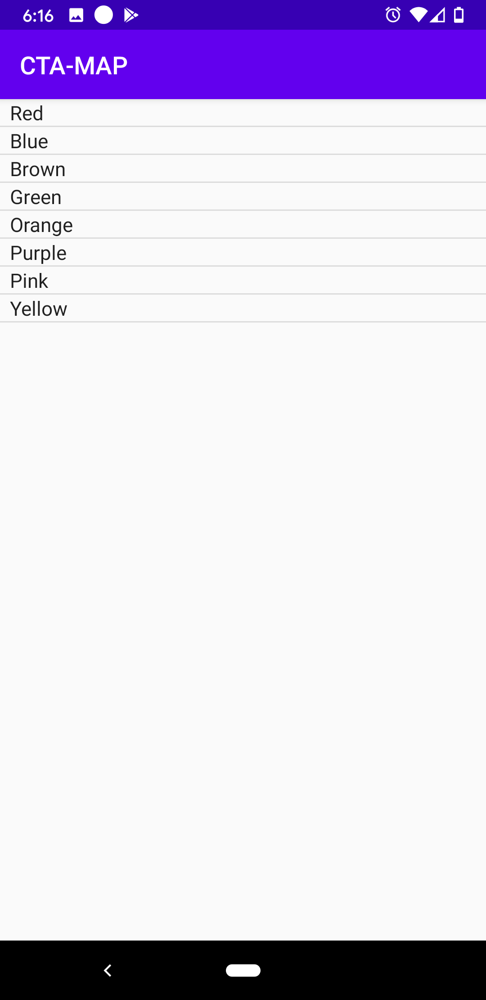
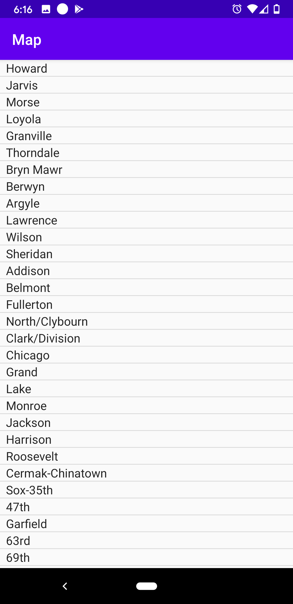
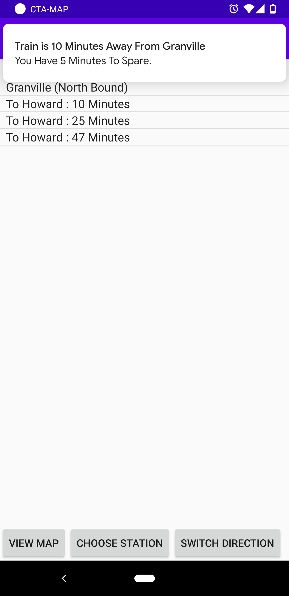
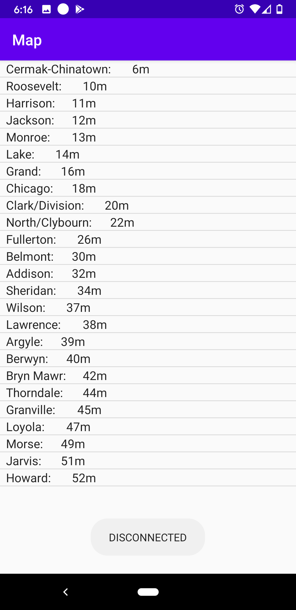
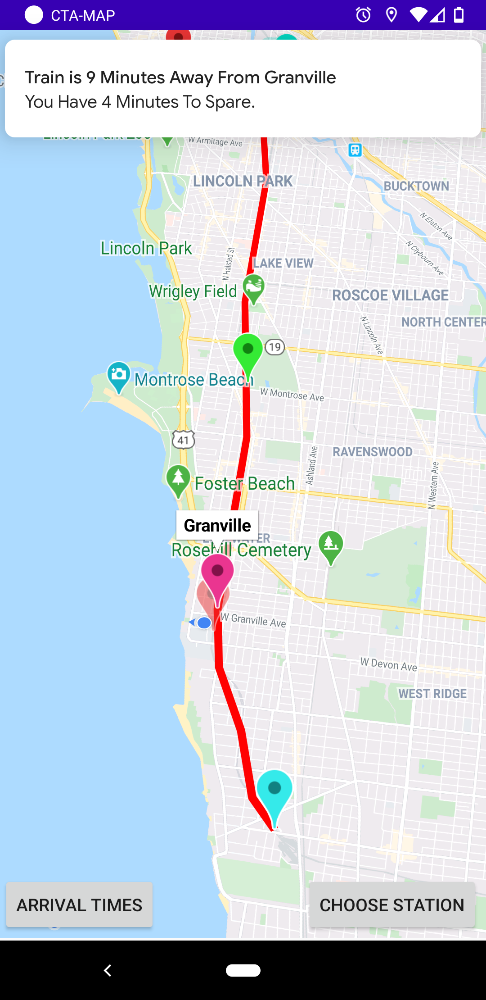
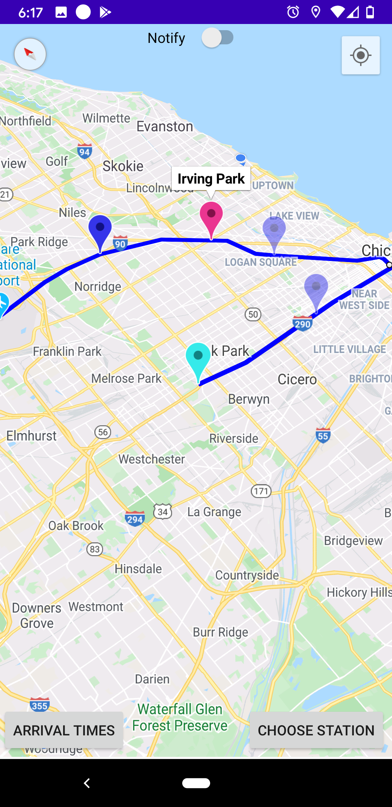

#  Android-CTA-Live-Transit-Tracker

Live-Updates From Nearest Trains For Android Devices 

 # Introduction
 
<dl>
 

 
 The Chicago Transit Authority (CTA) is the operator of mass transit in Chicago, 
 Illinois and some of its surrounding suburbs, including the trains of the Chicago "L" and CTA bus service.
 
As a local in Chicago, we often face the daily hassle of catching the train on time to our daily station. Sometimes we do not know where our transit is at nor when it would be an appropriate time to leave our current location to our indicated station. Chicago's CTA service offers Apps or TEXT-messages that give us an approximation when a train or bus will be arriving, however, oftentimes this can be a hassle to keep looking back at; especially if you are in a hurry. This project expands existing technologies to provide users more transits, get their current locations, and provide appropriate approximations for when it is recommended to leave based on their location. 
 
 

 
# Technologies
 
 

 
 - Android Studio 3.6.3
 
 - Java (Gradel Version - 5.6.4)
 
 - Google Maps API

 - JSOUP - 1.11.1
 
 - SQLite
 
 - Google Maps Android API v2
 
 - Google play-services-location:17.0.0'
 
 

 
 
# Setup

 
 To start, make sure you have the most updated version of Android Studio. 
 
 `Android Gradle Plugin Version 3.6.3`
 
 And,
 
 `Gradle Version 5.6.4`
 
 Next: In `AndroidManifest.xml`
 
 Make sure you have (or add) the following permissions: 
 
 `
   <uses-permission android:name="android.permission.ACCESS_COARSE_LOCATION"/>
    <uses-permission android:name="android.permission.ACCESS_FINE_LOCATION" />
    <uses-permission android:name="android.permission.INTERNET" />
    <uses-permission android:name="android.permission.READ_EXTERNAL_STORAGE" />
    <uses-permission android:name = "android.permission.WRITE_EXTERNAL_STORAGE"/>
 `
 
 
 The `ACCESS_COARSE/FINE_LOCATION` permissions are not required to use Google Maps Android API v2, but you must specify either coarse or fine location permissions for the `MyLocation` functionality.
 
 
 Now head to `build.gradle(:app)` and add at the end of `dependencies`:
 
 `{`

`implementation 'org.jsoup:jsoup:1.11.1'`
 
 `}`
 
 At the time of this project the most current version was `1.11.1` for Jsoup, but make sure you have the most latest version to avoid any faulty functionalities.
 
 
 # Features
 
 - Live 3D Mapping of Chicago and current transits
 
 - View of user's current location
 
 - Google Maps API for directions based on current location to target station
 
 - Distance calculation based on the current location at the indicated station
 
 - Color code change based on the distance of the nearest train (Green -> Yellow -> Blue)

- Displays all possible indicated transits and their Estimated Approximation Times (ETA)

- Displays train exact location rather than only ETA 

- Indicates if a train is approaching the target station or if any live train is delayed. 

- Switch train direction while viewing its live mapping

-  Notify users when the app is running and when the nearest train is arriving
 
 ### To Do:
 
 - Have a flexible user interface when choosing which line and station to track
 
 - Give users the option to not have user location if not preferred
 
 - Create AWS server for user profile and data
 
 - Adjustable Notification for users prefrences
 

 
 
 # Illustrations
 
 
 `Blue` marker indicates that the user may not reach that current train 

`Yellow` marker indicates they still may make it but would have to leave soon.

`Green` marker indicates they have time to spare. The amount of time to spare is indicated on the status bar. 

`pink` marker is the target station

`light blue` marker is the train's final destination (its direction)
 
 

 

 Current HomeScreen   |  Station Transit(s)
:-------------------------:|:-------------------------:
  |  

<dl> </dl>

As time progresses, the train will get closer to our target location and the changing from `Green` --> `Yellow` --> `Blue`

Each color indication is determined by the approximate distance based on the current user location. 

Train Tracking & User Notification   |  Example train ETAs for each station untill arrival to target station
:-------------------------:|:-------------------------:
  |  

 Live Mapping & User Notification   |  Blue line transits to Forest Park
:-------------------------:|:-------------------------:
  |  

 
 
</dl>

 
