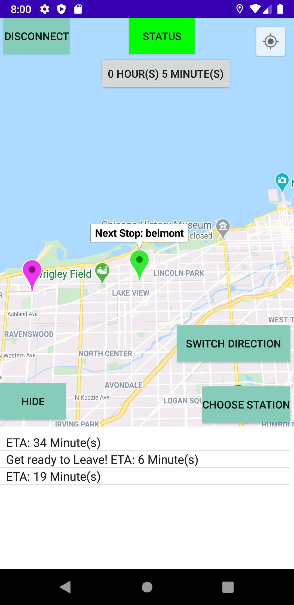
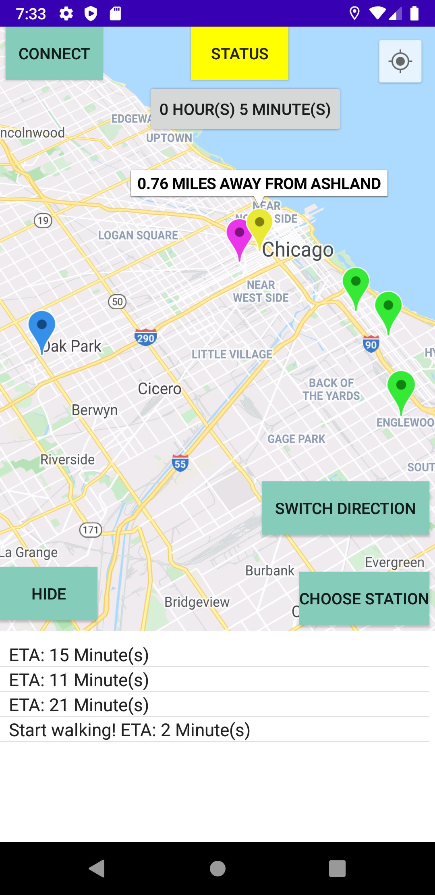
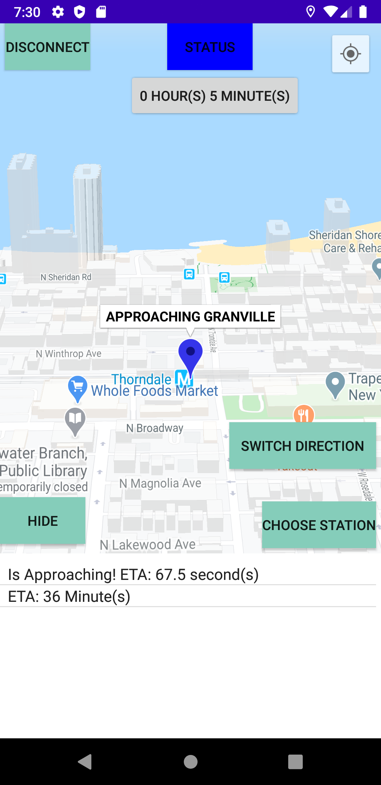
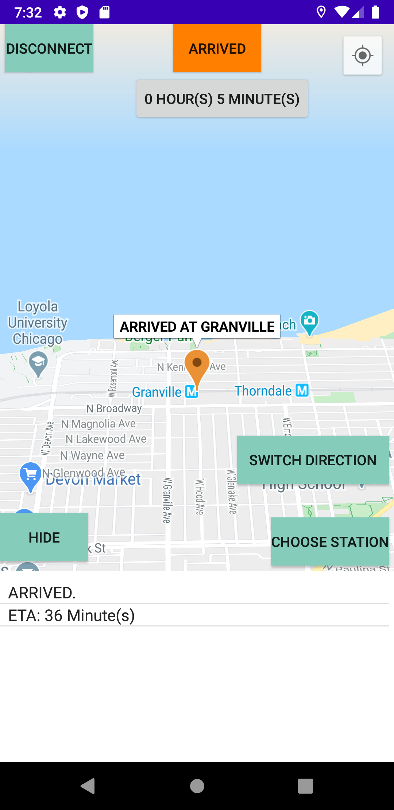

# LIVE-TRACKING-CTA-MOBILE
Live-Updates From Nearest Trains For Android Devices 

<dt>Tools Used: </dt>
 - JSOUP - For XML continous extraction
 
 <dt>Data Obtained and Extracted: </dt>
 
 - XML Document (CTA transit data)

- train_Stations.csv (Mapping of all station coordinates (LAT/LON))

<dl>
  <dt>Inital Description:</dt>
 The Chicago Transit Authority (CTA) is the operator of mass transit in Chicago, 
 Illinois and some of its surrounding suburbs, including the trains of the Chicago "L" and CTA bus service.
 
 In this project, we will be using Chicago's CTA transit API. 
 

 <dt>API description: </dt>
  <dd>
  
The CTA Train Tracker APIs provide a gateway into near-real-time CTA bus train estimated arrival times. You can use the official CTA Train Tracker service via Web or mobile device.
  
  
  The API makes it easy for developers to get specific, machine-readable information from CTA Train Tracker to incorporate estimated arrival/route progress information into innovative apps--mobile, online, or at locations.
  </dd>

 <dt>Baseline Approach: </dt>
<dd>

The mobile application updates itself every 5 seconds to estimate live tracking effiency

 
 

  
This Android Mobile Application allows live viewing for each and any train that the user wants to track.
 This CTA tracker allows user location to give an estimation for the time he/she needs to leave from their current location
 to catch its nearest train. 
 
 <dt>How this is different from offical CTA tracker apps: </dt>
 
 - Allows user's current location and calculates walk distance from their current location and their target station
 
 - Users can see more live trains than provided in other official apps
 
 - Notifies the user when they should leave based on the location on the train
 
 - Live 3D Viewing for each train 
 
 - Color indications based on distance and Estimated Time Arrivals (ETA)
 
  
 
---

 <dt>Initial MAP Viewings </dt>
 <dd>
  
Example Viewing of trains approaching Granville Station.

  
  - Green (Time to spare before train arrival)
  
  - Yellow (2 - 4 Minutes before train arrives Based on User's Location)
  
  - Blue (Train is Approaching))
  
  - Orange (Train Arrived at station)
  
  - Purple Marker (Target Station: Station the user picks)
  
  - light Blue (Train final Destination)
  <dd>
</dl>

Green Marker (Time to spare based on user location)   | Yellow Marker (Users walk distance > Train distance from the station)
:-------------------------:|:-------------------------:
  |  

<dl> </dl>

Blue Marker (Train is Approaching)   |  Orange Marker (Train has Arrived)
:-------------------------:|:-------------------------:
  |  

---

   
   
 
 <dd>
 

 

</dl>

