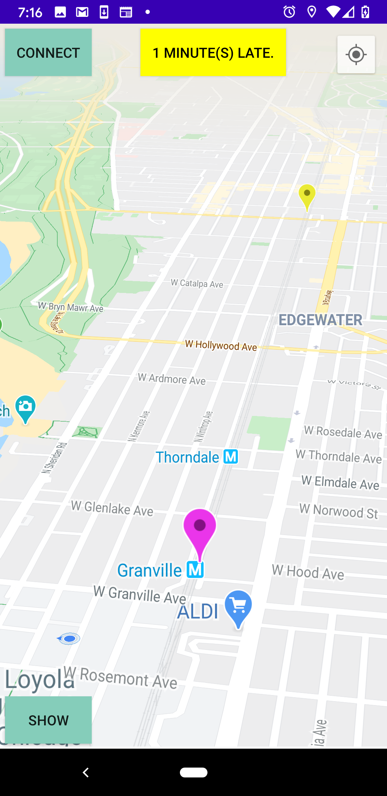

#  Android-CTA-Live-Transit-Tracker

Live-Updates From Nearest Trains For Android Devices 

 # Introduction
 
<dl>
 

 
 The Chicago Transit Authority (CTA) is the operator of mass transit in Chicago, 
 Illinois and some of its surrounding suburbs, including the trains of the Chicago "L" and CTA bus service.
 
As a local in Chicago, we often face the daily hassle of catching the train on time to our daily station. Sometimes we do not know where our transit is at nor when it would be an appropriate time to leave our current location to our indicated station. Chicago's CTA service offers Apps or TEXT-messages that give us an approximation when a train or bus will be arriving, however, oftentimes this can be a hassle to keep looking back at; especially if you are in a hurry. This project expands existing technologies to provide users more transits, get their current locations, and provide appropriate approximations for when it is recommended to leave based on their location. 
 
 

 
# Technologies
 
 

 
 - Android Studio 3.6.3
 
 - Java (Gradel Version - 5.6.4)
 
 - Google Maps API

 - JSOUP - 1.11.1
 
 - Google Maps Android API v2
 
 - Google play-services-location:17.0.0'
 
 

 
 
# Setup

 
 To start, make sure you have the most updated version of Android Studio. 
 
 `Android Gradle Plugin Version 3.6.3`
 
 And,
 
 `Gradle Version 5.6.4`
 
 Next: In `AndroidManifest.xml`
 
 Make sure you have (or add) the following permissions: 
 
 `
   <uses-permission android:name="android.permission.ACCESS_COARSE_LOCATION"/>
    <uses-permission android:name="android.permission.ACCESS_FINE_LOCATION" />
    <uses-permission android:name="android.permission.INTERNET" />
    <uses-permission android:name="android.permission.READ_EXTERNAL_STORAGE" />
    <uses-permission android:name = "android.permission.WRITE_EXTERNAL_STORAGE"/>
 `
 
 
 The `ACCESS_COARSE/FINE_LOCATION` permissions are not required to use Google Maps Android API v2, but you must specify either coarse or fine location permissions for the `MyLocation` functionality.
 
 
 Now head to `build.gradle(:app)` and add at the end of `dependencies`:
 
 `{`

`implementation 'org.jsoup:jsoup:1.11.1'`
 
 `}`
 
 At the time of this project the most current version was `1.11.1` for Jsoup, but make sure you have the most latest version to avoid any faulty functionalities.
 
 
 # Features
 
 - Live 3D Mapping of Chicago and current transits
 
 - View of user's current location
 
 - Google Maps API for directions based on current location to target station
 
 - Distance calculation based on the current location at the indicated station
 
 - Color code change based on the distance of the nearest train (Green -> Yellow -> Blue)

- Displays all possible indicated transits and their Estimated Approximation Times (ETA)

- Displays train exact location rather than only ETA 

- Indicates if a train is approaching the target station or if any live train is delayed. 

- Switch train direction while viewing its live mapping
 
 ### To Do:
 
 - Have a flexible user interface when choosing which line and station to track
 
 - Give users the option to not have user location if not preferred
 
 - Notify users when the app is running and when the nearest train is arriving
 
 
 # Illustrations
 
 
 `Blue` marker indicates that the user may not reach that current train 

`Yellow` marker indicates they still may make it but would have to leave soon.

`Green` marker indicates they have time to spare. The amount of time to spare is indicated on the status bar. 

`pink` marker is the target station

`light blue` marker is the train's final destination (its direction)
 
 

 
`On the left`, the user may input their target station, line, and direction of the train as you normally would in existing CTA's transit locators.  

`On the right`, we see its current live transits with their specific latitude and longitude location. The application extracts its data from the Chicago Transit Authority's API `XML` URL using `Jsoup` and it is updated every 5 seconds.

Each train line is color-coded with their appropriated color.

For Example, `Red` Line train markers will be colored 'Red'. `Blue` Lines will have 'Blue' Markers and so on...

We can see that those trains that are farther than 20 minutes away from the target station have a `low opacity` with its appropriate color. In this case, |  Granville Station 'Red Line' (marked in `pink`)| and the train's final destination (`Howard` Marked in `blue`) 

From here, the application then gathers the `user's location` (latitude and longitude) and calculates its distance from its current position to its target station. 

As it displays that the user is currently `5 minutes away` from Granville and the nearest train is `19 minutes` away, this indicates that the based on the user's current location, they have `14 minutes` to spare before heading out to the station without missing the nearest train.  We can also view even further trains and where they are exactly. 

 Current HomeScreen   |  Granville Station Transit(s)
:-------------------------:|:-------------------------:
  |  

<dl> </dl>

As time progresses, the train will get closer to our target location and the changing from `Green` --> `Yellow` --> `Blue`

`On the left`, you can see that that the user is currently `5 minutes away` from Granville but the nearest train is `1 minute away` before reaching our target station. We can see on the top, our status changes color to `blue` to indicate that the user `may not reach the train on time` based on their current location. but may still have a chance to reach the next nearest train which is `18 minutes away`

Each color indication is determined by the approximate distance based on the current user location. 

`On the right`, we can see that the user is `238 minutes late` (walking distance) to station `Ashland Green Line`. 

Because of the user's current distance, both trains that are at most `20 minutes away` from the target location, the user is most likely not able to make those trains. Of course, those trains that are `farther away` from than `20 minutes` are indicated with a `low opacity` with their appropriate train line color.  

User is late to reach nearest train   |  Blue marker late indications for green line to Ashland
:-------------------------:|:-------------------------:
  |  

 User is late to reach the nearest train   |  Blue line transits to O'hare
:-------------------------:|:-------------------------:
  |  

 
 
</dl>

 
